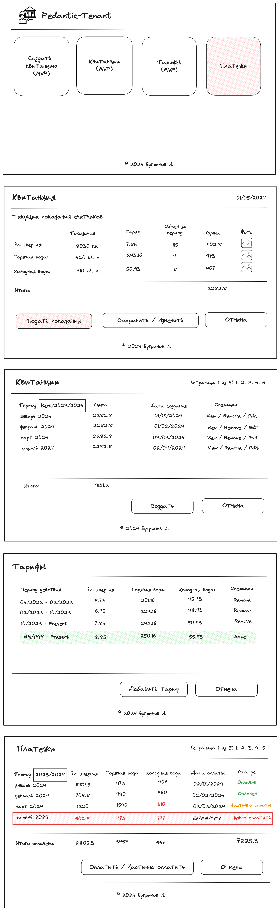

# Pedantic-Tenant

Pedantic-Tenant (Педантичный Арендатор) - это сервис позволяющий вести учет коммунальных услуг арендатором. Задача сервиса формировать каждый месяц квитанцию на основании показаний счетчиков и рассчитывать сумму платежей с использованием действующих тарифов. Также сервис своевременно информирует пользователя о предстоящем платеже. 

> Вне рамок MVP планируется управление сервисом с помощью бота в телеграмм

## Визуальная схема

## Документация

1. Маркетинг и аналитика
   1. [Целевая аудитория](./docs/01-biz/01-target-audience.md)
   2. [Stakeholders](./docs/01-biz/02-stakeholders.md)
   3. [Пользовательские истории](./docs/01-biz/03-bizreq.md)
2. Аналитика:
   1. [Функциональные требования](./docs/02-analysis/01-functional-requiremens.md)
   2. [Нефункциональные требования](./docs/02-analysis/02-nonfunctional-requirements.md)
3. DevOps
   1. [Файлы сборки](./deploy)
4. Архитектура
   1. [ADR](docs/03-architecture/01-adrs.md)
   2. [Описание API](docs/03-architecture/02-api.md)
   3. [Компонентная схема](docs/03-architecture/03-arch.md)